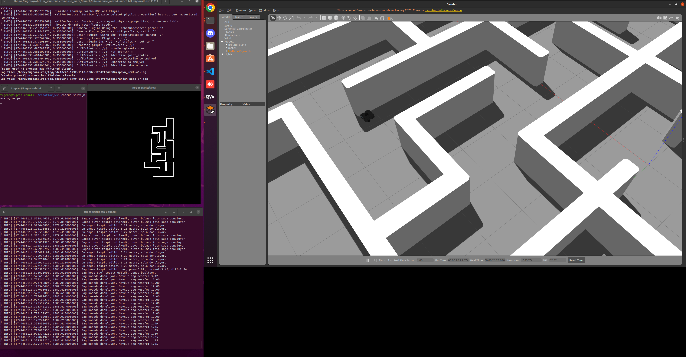
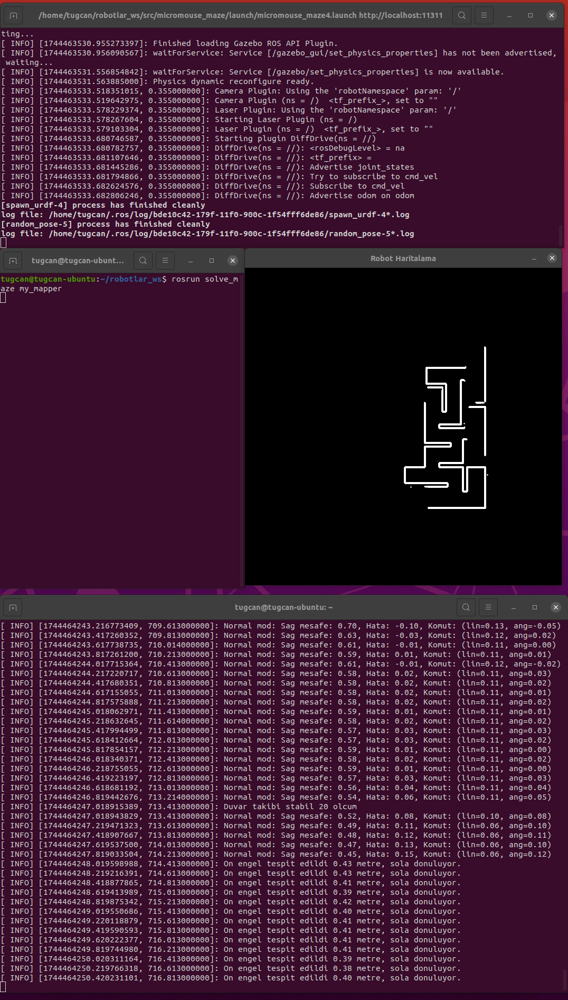
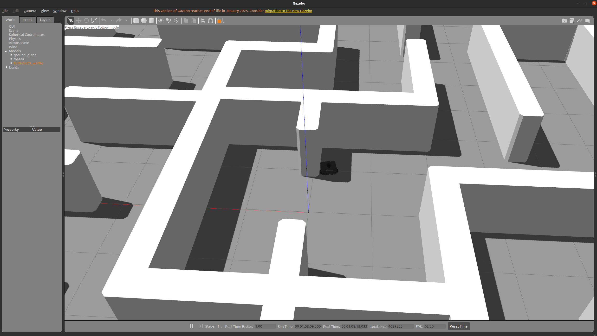
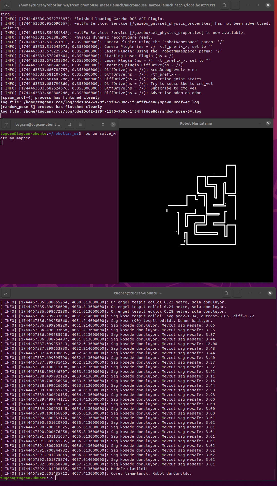
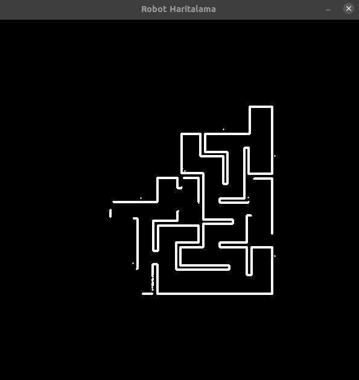
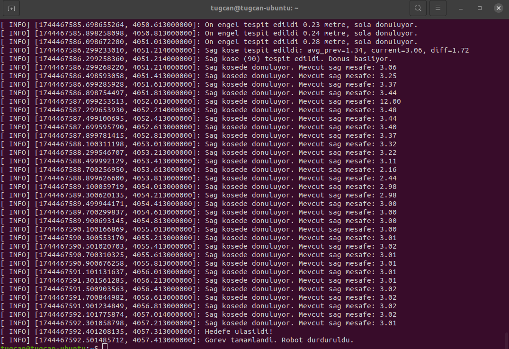

# Turtle Bot Micromouse Maze Solver with ROS and C++

## Installation and Initialization of the Environment
In this assignment I used micromouse maze 4 and turtlebot3 waffle. We will initialize and use them.

The assignment includes the following two packages and the solve_maze package developed by me.

#### Installation

```
git clone https://gitlab.com/blm6191_2425b_tai/members/24501118/hw1.git
```

### Initializing the Environment
We go to the main folder.

```
cd ./hw1/robots_ws
```

We use our code to build the code just in case. And we choose waffle as the model.

```
export TURTLEBOT3_MODEL=waffle
catkin_make clean
catkin_make
source devel/setup.bash
```

Then we start our environment.

```
roslaunch micromouse_maze micromouse_maze4.launch
```

When we do this, we are waiting for gazebo and Rviz to open. (If these operations are done with root, there may be problems because Gazebo GUI does not work very well with root, it is healthier to do it with a normal user)

## Observing the Solution and Outputs

### Observing the Solution

All the codes I have solved are located in the following location, in this location you will find 3 solutions. The first one is my first iteration, my_solver (completes the maze by going quite close to the wall)

```
hw1/robots_ws/src/solve_maze
```

The second is my_solver_oscillating, the version I developed in the first iteration, which completes the maze by going further away from the wall (it follows the wall by making an oscillating "S" shape).

And finally my_mapper is the code that maps the area our robot travels. You can run all three codes in the following ways and see how they work.

First solution
```
rosrun solve_maze my_solver
```

Second solution
```
rosrun solve_maze my_solver_salinimli
```

Map builder
```
rosrun solve_maze my_mapper
```

#### Outputs
After the maze is run and
```
rosrun solve_maze my_solver_saline
```
and
```
rosrun solve_maze my_mapper
```
the robot will try to complete the maze and start mapping as follows.



After running our solution and mapping for a while, we will get an image and outputs as follows, since the robot will also do mapping while traveling. (You can follow all the decisions and outputs of the robot from the console.)



After a while, our robot will complete the maze by following the right wall and stop itself at the target point in the middle, we can see this position in the figure below.



When we follow the outputs and the final mapping, we will be able to see our output and final map that the process is complete.



Our final map will be exactly as follows.



And finally, when we see the following output in our outputs, the robot is where it needs to be.



In this way, we solved the maze with wall following and mapping.

Translated with DeepL.com (free version)
